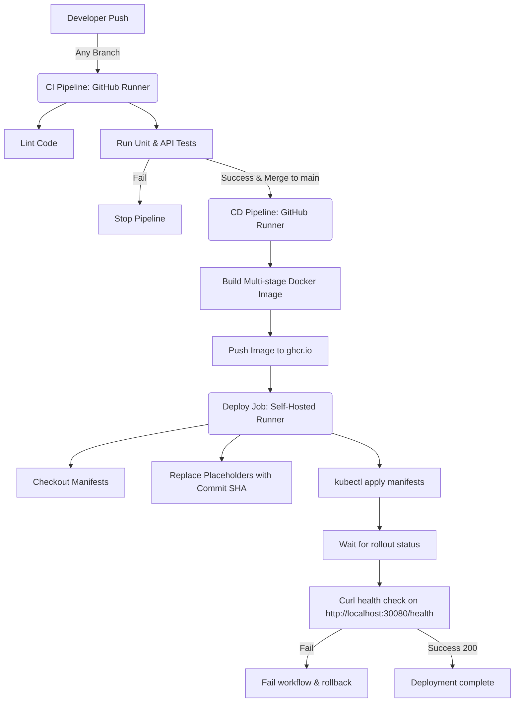

# URL Shortener API with Full CI/CD Pipeline

A lightweight URL shortener service built with Node.js and Express, containerized using a multi-stage Docker build, and automated with a GitHub Actions CI/CD pipeline deploying to a local Kubernetes (`kind`) cluster via a self-hosted runner.

## Core Features
- `POST /shorten`: Validate original URL and generate a unique, short code.
- `GET /:code`: Redirects user to original URL with 302 status code.
- `GET /health`: Health status endpoint returning a `200 OK` (readiness/liveness check).
- In-Memory store abstracted behind clean interface for easy future migrations (Redis, SQLite, Postgres).

---

## 1. Local Development

### Prerequisites
- Node.js (v20 or higher)
- Docker
- Kubectl
- Kind (Kubernetes-in-Docker)

### Setup & Run
Install dependencies and run the server:
```bash
npm install
npm start
```
The server will start on port `3000`.

### Running Tests
Execute unit and API integration tests with Jest:
```bash
npm test
```

### Run Linter
Execute the ESLint code formatter check:
```bash
npm run lint
```

---

## 2. Running Containerized Locally

### Build the Docker Image
The build uses a multi-stage `Dockerfile` to optimize output image size and improve security.
```bash
docker build -t url-shortener:local .
```

### Run the Container
Run the container and expose port `3000`:
```bash
docker run -d -p 3000:3000 --name url-shortener-app url-shortener:local
```

### Test Container Health
Verify container is running and healthy:
```bash
docker ps
curl http://localhost:3000/health
```

---

## 3. Local Kubernetes (`kind`) Setup & Deployment

### Step 1: Create Kind Cluster with Port Forwarding
To allow localhost traffic to reach NodePort services directly (such as port `30080`), spin up the `kind` cluster using a configuration file containing port mappings:

Create a `kind-config.yaml` file:
```yaml
apiVersion: kind.x-k8s.io/v1alpha4
kind: Cluster
nodes:
- role: control-plane
  extraPortMappings:
  - containerPort: 30080
    hostPort: 30080
    listenAddress: "127.0.0.1"
    protocol: TCP
```

Create the cluster using this config:
```bash
kind create cluster --config kind-config.yaml --name dev-cluster
```

### Step 2: Build & Load Image into Kind (Manual Verification)
If you want to run manually without pushing to GitHub Container Registry first:
```bash
# Build the image locally
docker build -t url-shortener:local .

# Load the image into the kind cluster
kind load docker-image url-shortener:local --name dev-cluster
```

### Step 3: Deploy to Kubernetes Manually
Before applying, update the placeholder values in the deployment manifest (`k8s/deployment.yaml`) with the locally loaded image tag:
```bash
# Edit k8s/deployment.yaml to use: url-shortener:local
# Then apply files:
kubectl apply -f k8s/deployment.yaml
kubectl apply -f k8s/service.yaml
```

Check the status of rollout and service:
```bash
kubectl rollout status deployment/url-shortener-deployment
kubectl get pods
kubectl get service
```

Test deployment from your host browser/terminal:
```bash
curl http://localhost:30080/health
```

---

## 4. End-to-End CI/CD Pipeline

The pipeline is split into two distinct workflows triggered automatically by GitHub Actions:



### CI Workflow (`.github/workflows/ci.yml`)
- **Trigger**: Any push or Pull Request on any branch.
- **Environment**: Cloud-hosted runner (`ubuntu-latest`).
- **Steps**:
  1. Installs Node.js & project dependencies.
  2. Runs `npm run lint` for code style validation.
  3. Runs `npm test` using Jest & Supertest.

### CD Workflow (`.github/workflows/cd.yml`)
- **Trigger**: Push to the `main` branch (after CI checks succeed).
- **Environments**:
  1. **Build Job**: Cloud-hosted runner (`ubuntu-latest`) to build & push the container image to GitHub Container Registry (`ghcr.io`).
  2. **Deploy Job**: Runs on your **`self-hosted`** runner, which has local network access to your `kind` cluster.
- **Steps**:
  1. Authenticates to `ghcr.io`.
  2. Builds and tags the Docker image with the specific commit SHA: `ghcr.io/<owner>/url-shortener:<commit-sha>`.
  3. Pushes image to `ghcr.io`.
  4. On the `self-hosted` runner:
     - Updates `k8s/deployment.yaml` with the target image and tag.
     - Deploys the configuration via `kubectl apply`.
     - Monitors deployment status via `kubectl rollout status`.
     - Validates the deployed application health via a Curl loop checking `http://localhost:30080/health` (failing the pipeline loudly if the app does not respond with HTTP `200` within 30 seconds).
