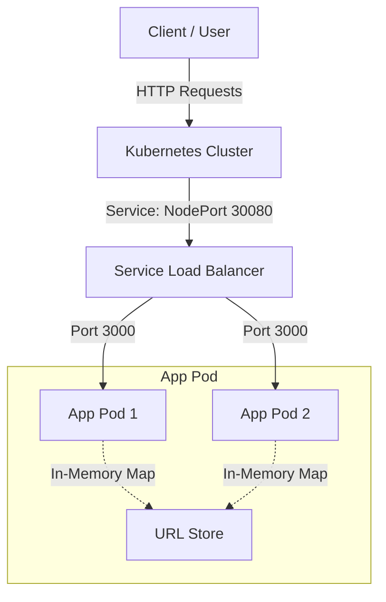

# System Architecture - URL Shortener with CI/CD

This document details the system design, file structure, and automation pipelines implemented for the URL Shortener service.

---

## 1. High-Level Architecture Overview

The system consists of a Node.js/Express web API, containerized with Docker, deployed to a local Kubernetes (`kind`) cluster, and automated with GitHub Actions.



---

## 2. Codebase & Components

### 2.1 Storage Layer (`src/store.js`)
- **Design**: Implemented behind a clean module interface exposing async methods: `saveUrl(code, url)`, `getUrl(code)`, `hasCode(code)`, and `clear()`.
- **In-Memory Store**: Currently uses a standard JavaScript `Map`.
- **Extensibility**: By isolating data operations to `store.js`, the route logic in `app.js` is database-agnostic. To swap in Redis, SQLite, or PostgreSQL, only this file needs to be modified.

### 2.2 Utility Functions (`src/urlUtils.js`)
- **URL Validation**: Employs the native `URL` constructor to enforce RFC-compliant web addresses and restricts protocols to `http:` and `https:`.
- **Short Code Generation**: Generates 6-character alphanumeric strings using cryptographically secure random integers (`crypto.randomInt`).
- **Collision Prevention**: The generation utilizes a character pool of size 62 ($62^6 \approx 56.8 \text{ billion combinations}$), virtually eliminating collisions. A safety check loop in the handler ensures absolute uniqueness.

### 2.3 Express Routing (`src/app.js`)
- `POST /shorten`: Validates input URL, generates a unique code, registers it, and returns the short code + generated URL.
- `GET /:code`: Looks up the code in the store. Performs a `302 Found` redirect if valid, or returns `404 Not Found` with a descriptive JSON payload.
- `GET /health`: The liveness/readiness endpoint returning the service status and current version string.

---

## 3. Containerization Strategy

The [Dockerfile](file:///c:/Soham/cicd/Dockerfile) is structured as a **multi-stage build** to optimize image weight and secure production:

1. **Stage 1 (Builder)**: Builds dependencies. Uses `node:20-alpine`, runs `npm ci` to get a precise environment, copies code, and prunes devDependencies (`npm prune --production`).
2. **Stage 2 (Runner)**: The production runtime. Only copies the application source code (`src/`) and production `node_modules` from the builder. Test files, dev configurations, and `.git` assets are completely omitted.
3. **Health Check**: Native Docker `HEALTHCHECK` runs every 15 seconds, using `wget` to query `/health` on port 3000 to flag unhealthy containers.

---

## 4. Kubernetes Infrastructure

The Kubernetes manifests live in the `k8s/` directory:

- **Deployment (`k8s/deployment.yaml`)**:
  - **Replicas**: 2 pods for high availability and load distribution.
  - **Rolling Update**: Strategy configured with `maxUnavailable: 0` and `maxSurge: 1`. During a deployment, a new pod is started and verified before any old pod is terminated, ensuring zero-downtime updates.
  - **Probes**: Configures both `livenessProbe` and `readinessProbe` checking `/health` every 10 seconds.
  - **Image Substitution**: Uses image placeholder `IMAGE_REPOSITORY_PLACEHOLDER:IMAGE_TAG_PLACEHOLDER` to avoid hardcoding production tags.

- **Service (`k8s/service.yaml`)**:
  - Exposes the deployment pods on internal port `3000` via a Kubernetes `NodePort` service.
  - Configures a NodePort of `30080` for local system debugging.

---

## 5. CI/CD Pipeline Flow

The workflow automation is split into a **Continuous Integration** job and a **Continuous Deployment** job.

### 5.1 CI Pipeline (`ci.yml`)
Runs automatically on every commit/push and Pull Request to **any** branch on GitHub.
- **Agent**: Public cloud-hosted runner (`ubuntu-latest`).
- **Steps**:
  1. **Checkout**: Pulls the source code.
  2. **Dependency Resolution**: Installs packages using `npm ci`.
  3. **Lint Verification**: Executes ESLint (`npm run lint`).
  4. **Test Executions**: Runs Jest unit and integration tests (`npm test`).
  - If any lint rule is broken or test fails, the build breaks immediately, blocking the deployment pipeline.

### 5.2 CD Pipeline (`cd.yml`)
Triggers only on pushes to the `main` branch, after CI checks pass. It is structured into two sequential jobs:

```mermaid
graph TD
    subgraph Job 1: Build & Push (GitHub Runner)
        A[Git Push to main] --> B[Lint/Test Pass]
        B --> C[Log in to ghcr.io]
        C --> D[Build & Tag Docker Image with Short SHA]
        D --> E[Push Image to GitHub Container Registry]
    end
    
    subgraph Job 2: Deploy to Cluster (Self-Hosted Runner)
        E --> F[Self-Hosted Runner Pulls Job]
        F --> G[Substitute Manifest Placeholders]
        G --> H[kubectl apply -f k8s/]
        H --> I[Wait for Rollout Status]
        I --> J[Start Background Port-Forward]
        J --> K[Curl http://localhost:8080/health]
        K -->|HTTP 200| L[Kill Port-Forward & Success]
        K -->|Failure| M[Kill Port-Forward & Fail Build]
    end
```

#### Job 2: The Self-Hosted Runner and Local Deployments
- **Self-Hosted Runner**: Because the local Kubernetes `kind` cluster resides behind a private home network/firewall, a public GitHub runner cannot reach it. The CD deploy job runs on a **self-hosted Windows runner** on the host machine.
- **Shell Compatibility**: Steps inside `deploy-to-kind` are configured with `shell: bash` to override the Windows runner default (PowerShell/CMD). This ensures utility commands like `sed` and standard POSIX shell scripts work natively (via Git Bash).
- **Post-Deploy Port-Forward Verification**:
  1. Starts a background `kubectl port-forward` tunnel to port `8080` targeting the service.
  2. Continually probes the service health via `curl http://localhost:8080/health` with retry-backoff logic.
  3. Uses a bash `trap` to guarantee the background port-forward process is cleanly terminated (`kill $PF_PID`) upon job completion or failure, avoiding orphaned background tasks.
